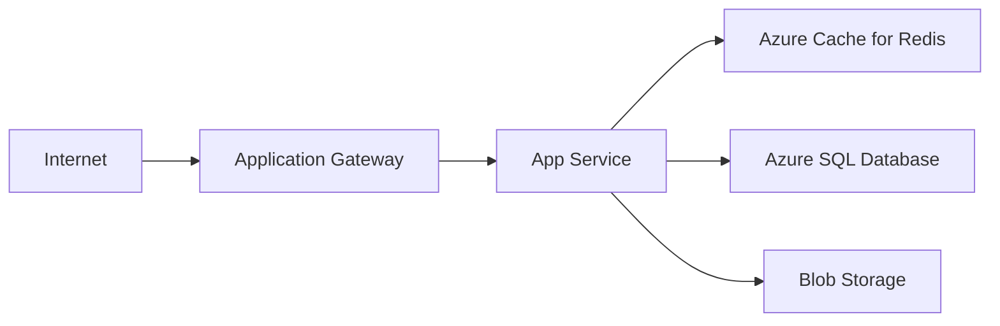
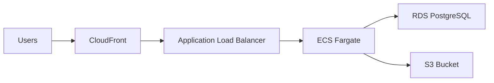

# tailor-mermaid-to-drawio

Convert Mermaid graph intent into clean Draw.io XML diagrams with cloud-specific icons (Azure/AWS) and consistent enterprise architecture layout.

## Installation

```bash
npx @tailorhub/skills@latest add https://github.com/TailorHub-Mad/ai-skills/tailor-mermaid-to-drawio
```

<Warning>
**Prerequisite:** This skill requires the Draw.io MCP server to be installed and enabled in your environment.

The skill will verify MCP availability before processing and fail fast if unavailable.
</Warning>

## Features

<CardGroup cols={2}>
  <Card title="Cloud-Native Icons" icon="cloud">
    Uses official Azure and AWS icon libraries for accurate service representation
  </Card>
  
  <Card title="Smart Icon Mapping" icon="map">
    Automatically maps service names to correct provider icons with fallbacks
  </Card>
  
  <Card title="Enterprise Layout" icon="sitemap">
    Organizes services into clear tiers (Edge, API, Compute, Data, Observability)
  </Card>
  
  <Card title="Database Engine Icons" icon="database">
    Prefers engine-specific icons (PostgreSQL, MySQL, MongoDB) over generic cylinders
  </Card>
</CardGroup>

## How It Works

<Steps>
  <Step title="Preflight Check">
    Verify Draw.io MCP tools are available. If not, fail fast with a prerequisite message.
  </Step>
  
  <Step title="Identify Provider & Scope">
    - Detect target cloud: Azure, AWS, or mixed
    - Preserve exact service labels from Mermaid source
    - Infer provider from service names if ambiguous
  </Step>
  
  <Step title="Load Icon Mapping">
    Read only the needed reference file:
    - `references/azure-icons.md` for Azure diagrams
    - `references/aws-icons.md` for AWS diagrams
    - Both for multi-cloud diagrams
  </Step>
  
  <Step title="Build Nodes with Image Icons">
    - Use image-style nodes with provider icon paths
    - Keep node text as exact service name
    - Apply smart fallbacks for unavailable icons
    - Use engine-specific database icons when appropriate
  </Step>
  
  <Step title="Apply Enterprise Layout">
    - Group services into containers by tier/domain
    - Keep data flow direction consistent (left-to-right)
    - Minimize connector crossings
    - Make ingress/egress boundaries explicit
  </Step>
  
  <Step title="Produce Draw.io XML">
    - Emit valid Draw.io XML (not Mermaid import)
    - Use provider library icon paths
    - Ensure readable text without overlaps
  </Step>
  
  <Step title="Verify Output">
    - Confirm XML format with `type=xml`
    - Check provider icon styles are present
    - Validate service icon choices
  </Step>
</Steps>

## Icon Mapping Strategy

The skill uses intelligent icon selection to ensure visual accuracy:

### Database Icons

<Accordion title="Database Engine Selection Logic">
  **Managed Service Icons** (when explicitly named):
  
  AWS:
  - RDS PostgreSQL → `mxgraph.aws4.rds_postgresql_instance`
  - RDS MySQL → `mxgraph.aws4.rds_mysql_instance`
  - Aurora → `mxgraph.aws4.aurora_instance`
  - DocumentDB → `mxgraph.aws4.documentdb_with_mongodb_compatibility`
  
  Azure:
  - Azure Database for PostgreSQL → Azure PostgreSQL service icon
  - Azure Database for MySQL → Azure MySQL service icon
  - Cosmos DB → Azure Cosmos DB icon (including Mongo API variants)
  
  **Generic Engine Icons** (when only engine name provided):
  - PostgreSQL → `mxgraph.alibaba_cloud.postgresql`
  - MySQL → `mxgraph.alibaba_cloud.mysql`
  - MongoDB → `mxgraph.alibaba_cloud.mongodb`
  
  The skill preserves exact labels while choosing the most appropriate icon based on context.
</Accordion>

### Kafka / Message Queue Icons

<Accordion title="Kafka Icon Selection">
  - Default: `mxgraph.alibaba_cloud.kafka` (most reliable rendering)
  - AWS MSK: Available when user explicitly requests AWS MSK branding
  - Prefers provider-native managed service icons when specified
  - Falls back to stable cross-provider icons when generic
</Accordion>

### Icon Fallback Rules

<Note>
When an exact icon is unavailable in the current Draw.io build, the skill chooses the nearest equivalent from the same domain/category while keeping the label exact.
</Note>

## Cloud Provider Support

### Azure

<CodeGroup>


```text Icon Mapping
Application Gateway → img/lib/azure2/.../application_gateway.svg
App Service → img/lib/azure2/.../app_services.svg
Azure Cache for Redis → img/lib/azure2/.../cache_redis.svg
Azure SQL Database → img/lib/azure2/.../sql_database.svg
Blob Storage → img/lib/azure2/.../storage_blob.svg
```
</CodeGroup>

### AWS

<CodeGroup>


```text Icon Mapping
CloudFront → mxgraph.aws4.cloudfront
Application Load Balancer → mxgraph.aws4.elastic_load_balancing
ECS Fargate → mxgraph.aws4.ecs / fargate
RDS PostgreSQL → mxgraph.aws4.rds_postgresql_instance
S3 Bucket → mxgraph.aws4.s3
```
</CodeGroup>

### Multi-Cloud

<Note>
For mixed Azure/AWS diagrams, both icon reference files are loaded to ensure correct mapping for each provider's services.
</Note>

## Enterprise Layout Conventions

The skill organizes diagrams into clear architectural tiers:

| Tier | Services | Position |
|------|----------|----------|
| **Edge** | CDN, API Gateway, Load Balancers | Left |
| **API** | API Services, App Services | Center-left |
| **Compute** | Container services, VMs, Functions | Center |
| **Data** | Databases, Caches, Storage | Center-right |
| **Observability** | Monitoring, Logging | Bottom/Side |
| **Shared Services** | Service Bus, Event Grid | As needed |

<Note>
Data flow direction is typically left-to-right (ingress → processing → storage).
</Note>

## Output Format

The skill produces valid Draw.io XML that can be:
- Opened directly in Draw.io desktop or web
- Embedded in documentation
- Version controlled alongside code

### Output Rules

<Accordion title="Quality Guarantees">
  - Preserve user-intended semantics from Mermaid
  - Prefer icon correctness over visual novelty
  - Production-ready: balanced spacing, aligned tiers, clear labels
  - Exact service names preserved even with fallback icons
  - No overlapping shapes or labels
  - Valid XML with proper icon path references
</Accordion>

## Usage Example

Provide a Mermaid diagram and request conversion:

```
Convert this Mermaid diagram to Draw.io with AWS icons:

graph LR
    Users --> ALB[Application Load Balancer]
    ALB --> ECS[ECS Fargate]
    ECS --> RDS[(PostgreSQL)]
    ECS --> S3[S3 Bucket]
    ECS --> ElastiCache[ElastiCache Redis]
```

The AI will:
1. Verify Draw.io MCP is available
2. Detect AWS as the provider
3. Load AWS icon mappings
4. Map each service to correct AWS icons
5. Apply enterprise layout with tiers
6. Generate Draw.io XML output
7. Return the diagram file

## Resources

The skill includes bundled icon mapping references:

- `references/azure-icons.md` - Azure service icon paths and mappings
- `references/aws-icons.md` - AWS service icon paths and mappings

<Warning>
These references are loaded automatically based on the detected cloud provider. You don't need to reference them manually.
</Warning>
